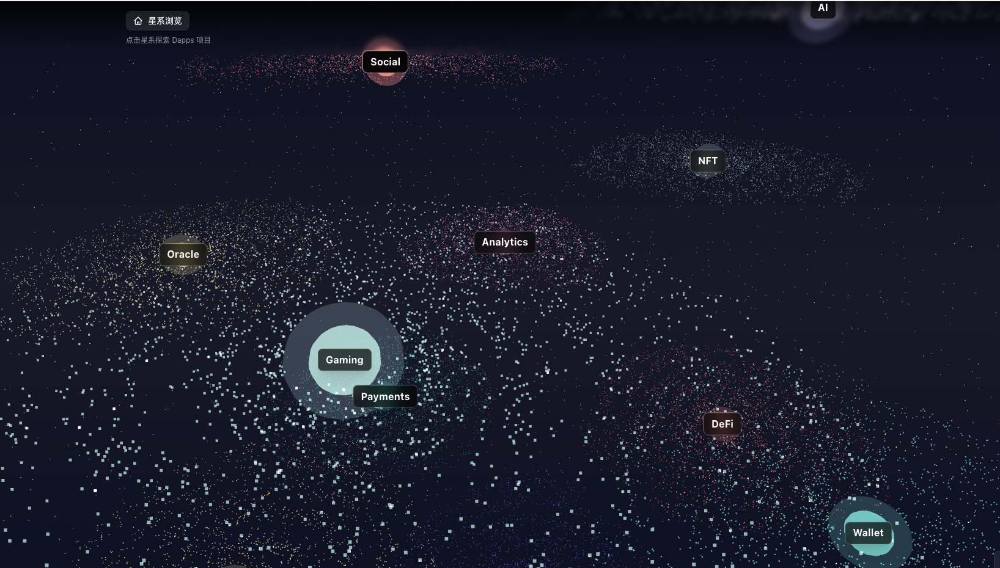

# 🌌 3D星系 Dapps 浏览器

一个沉浸式的3D星系浏览器，用于探索和展示Dapps项目生态。采用双层星系结构设计，提供独特的3D交互体验。



## ✨ 特性

- 🌟 **双层3D星系结构**: 第一层展示项目分类（星系云），第二层展示具体项目（星球）
- 🎨 **沉浸式视觉效果**: 螺旋星系、发光水晶球、背景星空
- 🖱️ **丰富的交互体验**: 拖拽旋转、滚轮缩放、悬停高亮、自动旋转
- 🎬 **平滑过渡动画**: 层级切换时的相机动画，流畅自然
- 📱 **响应式设计**: 支持桌面端和移动端
- ⚡ **高性能渲染**: 基于 Three.js 和 React Three Fiber

## 🚀 快速开始

### 环境要求

- Node.js 18.x 或更高版本
- npm 或 pnpm

### 安装

```bash
# 克隆项目
git clone https://github.com/your-username/mission9_planet.git
cd mission9_planet

# 安装依赖
npm install
# 或
pnpm install
```

### 开发

```bash
# 启动开发服务器
npm run dev

# 在浏览器中打开
# http://localhost:3000
```

### 构建

```bash
# 生产构建
npm run build

# 启动生产服务器
npm run start
```

## 🎮 使用指南

### 第一层：星系云层级

1. 页面加载后，你会看到多个旋转的螺旋星系排列成球形
2. 每个星系代表一个 Dapps 分类（钱包、DEX、LST、借贷、NFT等）
3. **拖拽旋转**: 按住鼠标左键拖动，旋转整个星系阵列
4. **滚轮缩放**: 滚动鼠标滚轮放大或缩小视图
5. **悬停查看**: 将鼠标悬停在星系上，星系会放大并显示分类名称
6. **点击进入**: 点击任意星系，相机会平滑过渡到第二层

### 第二层：项目星球层级

1. 进入第二层后，你会看到多个发光的水晶球排列成球形
2. 每个水晶球代表一个具体的 Dapps 项目
3. **交互方式**: 与第一层相同（拖拽、缩放、悬停）
4. **查看详情**: 点击任意星球，弹出模态窗口显示项目详细信息
   - 项目名称
   - 项目描述
   - 官网链接
   - TVL（总锁仓量）
5. **返回上层**: 点击页面顶部的面包屑导航返回第一层

### 键盘快捷键

- `Esc`: 关闭模态窗口
- `Space`: 暂停/恢复自动旋转（规划中）

## 🏗️ 技术栈

- **框架**: [Next.js 14](https://nextjs.org/) (App Router)
- **3D引擎**: [Three.js](https://threejs.org/)
- **React集成**: [@react-three/fiber](https://docs.pmnd.rs/react-three-fiber)
- **3D工具库**: [@react-three/drei](https://github.com/pmndrs/drei)
- **动画库**: [GSAP](https://greensock.com/gsap/)
- **语言**: TypeScript
- **样式**: Tailwind CSS

## 📁 项目结构

```
mission9_planet/
├── app/                    # Next.js App Router
│   ├── layout.tsx         # 根布局
│   ├── page.tsx           # 主页面
│   └── globals.css        # 全局样式
├── components/            # React 组件
│   ├── Galaxy/           # 第一层：星系组件
│   ├── Planet/           # 第二层：星球组件
│   ├── UI/               # UI 组件
│   └── Effects/          # 特效组件
├── lib/                   # 工具函数和数据
│   ├── mockData.ts       # Mock 数据
│   ├── sphereLayout.ts   # 球形布局算法
│   ├── types.ts          # TypeScript 类型
│   └── constants.ts      # 常量配置
├── hooks/                 # 自定义 Hooks
├── public/                # 静态资源
│   └── data/             # JSON 数据文件
├── PLAN.md                # 项目实施计划
└── README.md              # 本文件
```

## 📊 数据格式

### 分类数据 (categories.json)

```json
{
  "categories": [
    {
      "id": "wallet",
      "name": "钱包",
      "description": "Web3钱包类应用",
      "color": "#4ECDC4"
    }
  ]
}
```

### 项目数据 (projects.json)

```json
{
  "projects": [
    {
      "id": "metamask",
      "categoryId": "wallet",
      "name": "MetaMask",
      "description": "全球最受欢迎的Web3钱包",
      "website": "https://metamask.io",
      "tvl": "$5.2B",
      "logo": "/images/metamask.png"
    }
  ]
}
```

## 🎨 自定义配置

### 修改颜色主题

编辑 `lib/constants.ts`:

```typescript
export const COLORS = {
  wallet: '#4ECDC4',
  dex: '#FF6B6B',
  lst: '#95E1D3',
  // ...
}
```

### 调整动画速度

编辑 `lib/constants.ts`:

```typescript
export const ANIMATION = {
  autoRotateSpeed: 0.1,     // 自动旋转速度
  hoverScale: 1.2,          // 悬停放大倍数
  transitionDuration: 1.5,  // 层级切换动画时长（秒）
}
```

### 修改球体半径

编辑 `lib/constants.ts`:

```typescript
export const LAYOUT = {
  sphereRadius: 10,         // 球形阵列半径
  galaxySize: 1,            // 星系大小
  planetSize: 0.8,          // 星球大小
}
```

## 🔧 性能优化

### 桌面端 vs 移动端

项目会自动检测设备类型并调整性能参数：

- **桌面端**: 完整粒子效果（10000个粒子）
- **移动端**: 简化粒子效果（5000个粒子），降低材质质量

### 手动优化

如果遇到性能问题，可以调整 `lib/constants.ts`:

```typescript
export const PERFORMANCE = {
  particleCount: 5000,      // 减少粒子数量
  enableShadows: false,     // 关闭阴影
  pixelRatio: 1,            // 降低像素比
}
```

## 🐛 故障排除

### 问题：页面空白，没有显示3D内容

**解决方案**:
1. 检查浏览器是否支持 WebGL（访问 https://get.webgl.org/）
2. 更新显卡驱动
3. 尝试其他浏览器（推荐 Chrome/Firefox）

### 问题：性能卡顿，帧率低

**解决方案**:
1. 减少粒子数量（见性能优化章节）
2. 关闭其他占用GPU的应用
3. 降低浏览器窗口大小

### 问题：点击无反应

**解决方案**:
1. 确保对象在视野内（尝试缩小视图）
2. 检查浏览器控制台是否有错误
3. 尝试刷新页面

## 📈 路线图

### v1.0 (当前版本)
- [x] 双层3D星系结构
- [x] 基础交互功能
- [x] Mock 数据支持

### v1.1 (计划中)
- [ ] 从 JSON 文件读取数据
- [ ] 搜索功能
- [ ] 项目过滤（按 TVL、分类等）

### v2.0 (未来)
- [ ] 集成真实 API（DeFi Llama）
- [ ] 实时数据更新
- [ ] 项目对比功能
- [ ] 用户收藏功能

### v3.0 (愿景)
- [ ] VR/AR 支持
- [ ] 多语言支持
- [ ] 主题切换
- [ ] 社交分享功能

## 🤝 贡献指南

欢迎贡献代码、报告问题或提出建议！

1. Fork 本仓库
2. 创建特性分支 (`git checkout -b feature/AmazingFeature`)
3. 提交更改 (`git commit -m 'Add some AmazingFeature'`)
4. 推送到分支 (`git push origin feature/AmazingFeature`)
5. 开启 Pull Request

## 📄 开源协议

本项目采用 MIT 协议 - 详见 [LICENSE](LICENSE) 文件

## 🙏 致谢

- [React Three Fiber](https://docs.pmnd.rs/react-three-fiber) - 优秀的 React Three.js 渲染器
- [Drei](https://github.com/pmndrs/drei) - 丰富的 Three.js 工具库
- [GSAP](https://greensock.com/) - 强大的动画库
- [Next.js](https://nextjs.org/) - 出色的 React 框架

## 📞 联系方式

- 项目主页: [GitHub](https://github.com/your-username/mission9_planet)
- 问题反馈: [Issues](https://github.com/your-username/mission9_planet/issues)
- 作者: Your Name

---

⭐ 如果这个项目对你有帮助，欢迎点个 Star！
